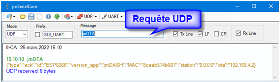
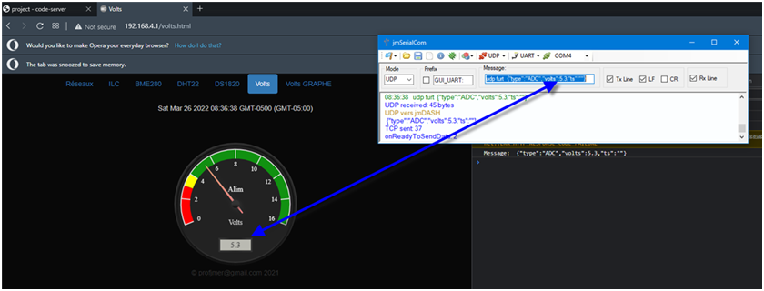
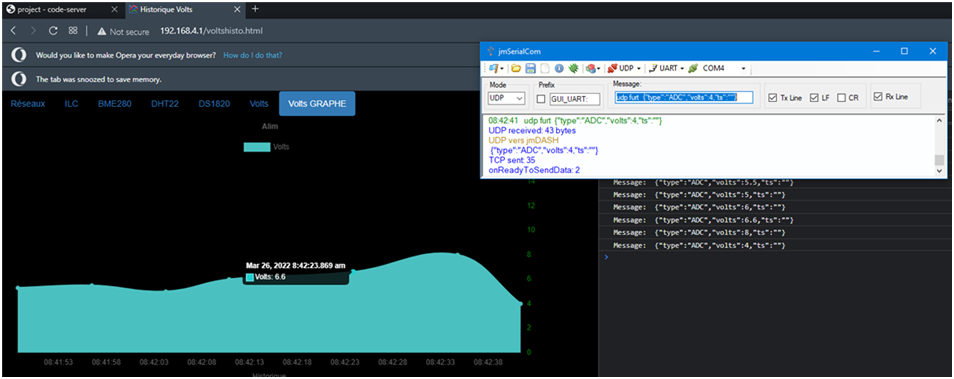
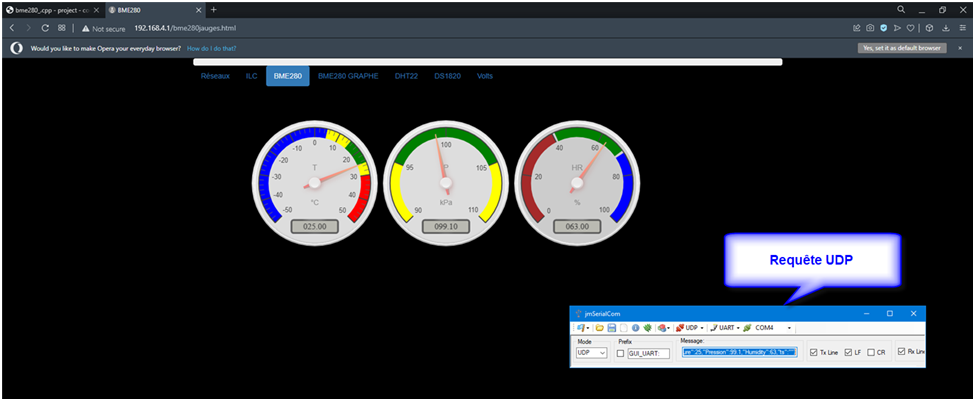
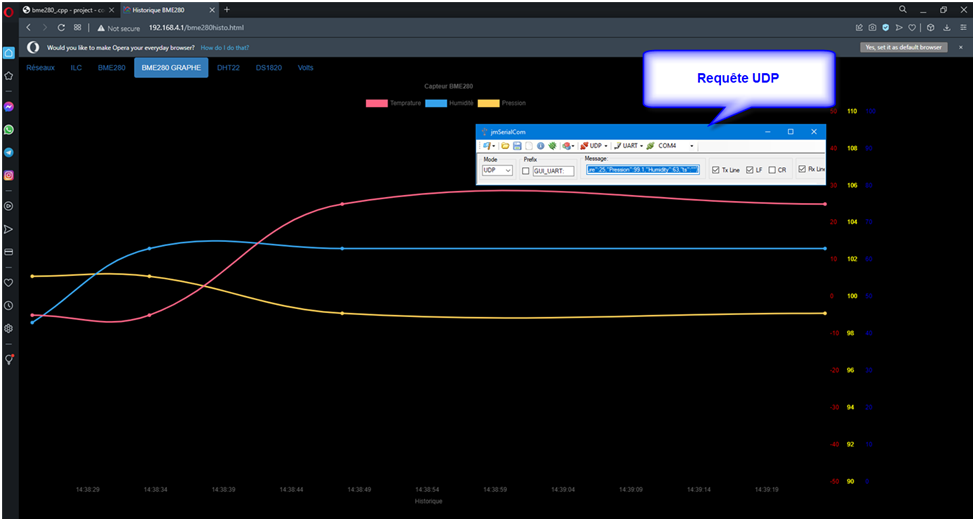
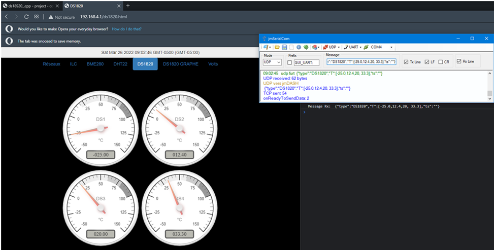
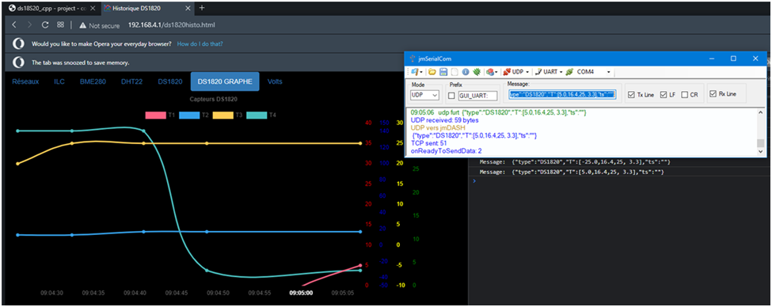
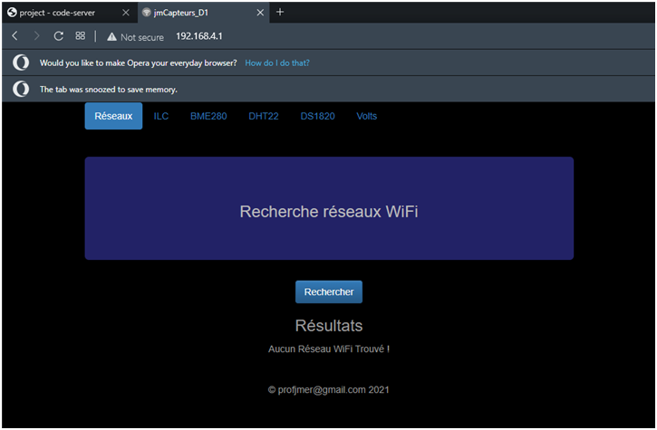

# **jmDASHmin**

jmDASHmin est un petit objet intelligent connecté servant de tableau de bord pour visualiser des données.

L'objet peut fournir son propre point d'accès ou se relier à un réseau.

Par la suite un fureteur permet d'accéder aux visualisations des données.

Il suffit d'alimenter l'objet et de lui fournir des données par lien physique série (USB ou UART) ou par WiFi UDP.

Les requêtes UDP ou par lien série permettent de modifier les valeurs des jauges et d'ajouter des points dans les graphes.

L'objet est un serveur de visualisation minimaliste.

# ​Requête d'identification des jmDASHmin dans le réseau

La requête udp jmOTA permet d'identifier les jmDASHmin dans un réseau.

Si la commande est broadcastée dans le réseau, alors tous les jmDASHmin vont s'identifier. (texte en or)

# ​Requête UDP pour accéder au fureteur

L'objet connecté contient un serveur WEB et un système de fichiers.

Le système de fichiers contient les pages Webs et les scripts de visualisation.

Lorsqu'une page est consultée, le serveur Web télécharge la page et son script et ouvre un canal de communication bidirectionnel entre l'objet et le fureteur.

Si l'objet reçoit une requête UDP il retransmet la requête au fureteur. Si la requête est reconnue par le fureteur alors elle est exécutée.

L'objet contient également un serveur FTP. Un client FTP peut se connecter (jmer 123) pour modifier le contenu des pages Webs et les scripts. L'objet n'a donc pas à être reprogrammé pour modifier son interface Web.

Voici des exemples de jauges et de graphes.

## ​Format de la commande: fur

### ​fur {"type":"ADC","volts":5.3,"ts":""}

Exemple jauge

ts est un timestamp, il peut être absent comme dans le cas présent. Alors c'est le fureteur qui ajoute le timestamp. 

#### ​

Exemple Graphe

La commande est identique, le nombre de point dans le graphe est configurable, par la suite un nouveau point décale les anciens vers la gauche et le plus ancien est perdu.

Ici le graphe est du type 'fill'

#### ​

## ​Exemples de visualisation de deux valeurs

### ​fur {"type":"DHT22","T":-5.0,"HR":43,"ts":""}

#### ​

## ​Exemples de visualisation de trois valeurs

### ​fur {"type":"BME280","Temperature":-5.0,"Pression":101.1,"Humidity":43,"ts":""}

#### ​Jauge

Tous les clients connectés à la page BME280 voient les valeurs poussées dans le graphe par les requêtes UDP.

Présentement tous les clients connectés peuvent pousser des valeurs dans les jauges.

#### ​Graphe

Tous les clients connectés à la page BME280 GRAPHE voient les valeurs poussées dans le graphe par les requêtes UDP. Présentement tous les clients connectés peuvent pousser des valeurs dans le graphe. Le timestamp est fourni par le fureteur.

## ​Exemple de valeurs en tableau

### ​fur {"type":"DS1820","T":[-25.0,12.4,20, 33.3],"ts":""}

###

## ​Page ILC

C'est la page permettant de lancer des commandes vers l'objet.

Elle affiche également les dernières valeurs des capteurs

###

## ​Page Réseaux

C'est la page qui scrute les réseaux accessibles et qui permet de se connecter à un de ces réseaux.

